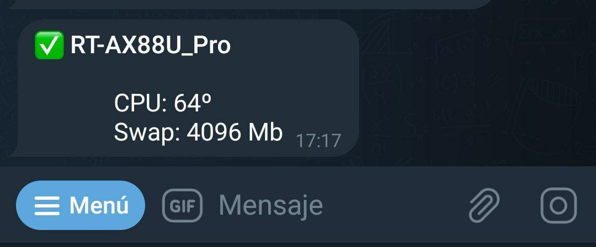

# Notificación Telegram al inicio

Un sencillo script que te manda una notificación al Telegram cada vez que inicia el router, con un minimo de informacion.&#x20;

El script lo guardo en `/jffs/scripts/post-mount`



El script del ejemplo, hace algunas comprobaciones y tareas, la primera monta la [swap](habilitar-swap.md), la segunda añade al cron una tarea que cada 12h libera la ram y otra tarea de meter un [script](https://github.com/AzagraMac/telegramInfoASUS) que notifica cada 2h el estado del router con información mas detallada, espera 10 segundos y realiza un ping a la DNS de Cloudflare, comprueba si ha salido bien el ping y te manda un mensaje al telegram, no antes comprueba si la swap esta montada, de no ser asi, cambia el mensaje a enviar, para hacerlo mientras estaba comiendo, ni tan mal.

```sh
#!/bin/sh
echo "Montando swap..."
swapon /tmp/mnt/sda1/file.swp

echo "Add Free RAM to cron..."
cru a freeram "0 */12 * * * /bin/sync && /bin/echo 3 > /proc/sys/vm/drop_caches"

echo "Add Telegram to cron..."
cru a telegram "0 */2 * * * sh /jffs/scripts/status.sh"

sleep 10
/bin/ping -c2 "1.1.1.1" > /dev/null 2>&1
if [ $? -ne 0 ]
then
        exit 0
else
    unset $MODEL_NAME
    unset $SWAP
    unset $BANNER
    unset $TEMP_CPU
    MODEL_NAME=$(nvram get wps_device_name)
    SWAP=$(free | grep Swap | awk '{ printf("%.0f", $2 / 1024) }')
    TEMP_CPU=$(cat /sys/class/thermal/thermal_zone0/temp | awk '{printf("%.0f\n", $1 / 1000) }')
    TELEGRAM_AUTH="/jffs/telegram.env"
    TOKEN=$(cat $TELEGRAM_AUTH | grep "TOKEN" | awk -F "=" '{print $2}')
    CHATID=$(cat $TELEGRAM_AUTH | grep "CHAT_ID" | awk -F "=" '{print $2}')
    API_TELEGRAM="https://api.telegram.org/bot$TOKEN/sendMessage?parse_mode=HTML"
    
    function sendMessage()
    {
        curl -s -X POST $API_TELEGRAM \
            -d chat_id=$CHATID \
            -d text="$(printf "<b>$BANNER</b>\n\n \
            CPU: $TEMP_CPUº\n \
            Swap: $SWAP Mb\n")" > /dev/null 2>&1
    }
    
    if [ "$SWAP" != "0" ]
    then
        BANNER="✅ $MODEL_NAME"
        sendMessage
    else
        BANNER="❌ $MODEL_NAME"
        sendMessage
    fi
fi
```
