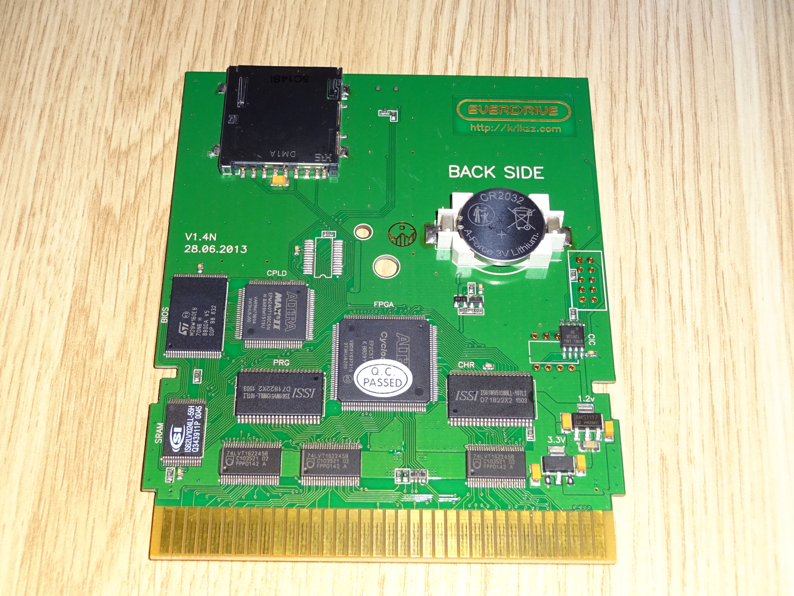

# EverDrive N8

<figure><figcaption></figcaption></figure>



**Specs:**

* Powerful Cyclone II FPGA.
* 2 x 512Kbyte SRAM for PRG and CHR data.
* 128Kbyte battery backed memory. It write save data to micro SD.
* Max II CPLD to handle FPGA reconfiguration, BIOS and SD interfaces.
* 1Mbyte flash BIOS.
* Voltage shift buffers on PPU and CPU bus for matching levels between 5v NES bus and 3.3 EverDrive bus. Far better than simple resistor buffers at reducing noise and power consumption

**Features:**

* Famicom, NES, and Twin Famicom systems are supported. Many NES/FC clones supported as well.
* Cart supports NES and FDS ROM images.
* Automatic disk side swap for FDS.
* Expansion audio, [NES systems require modification to support this feature.](https://github.com/azagramac/mods-nes/tree/master/AudioExpansionMod)
* Save State function
* Game Genie cheat code support.
* Automatically backs-up saves to micro SD card. There is no need to push reset before shutting down the system.\
  &#xNAN;_&#x46;DS is the only exception, user should push the reset button on system to get back to main menu before than shutting down the system, otherwise FDS save data will be lost._
* Mapper support can be extended via software updates. As easy as loading new mappers files on micro SD card.
* FAT / FAT16 / FAT32 file system formats are supported.
* Supports micro SD cards up to 32GB.
* Quick loading (4-8 seconds approx).

<figure><figcaption></figcaption></figure>

<figure><figcaption></figcaption></figure>

<figure><figcaption></figcaption></figure>

<figure><figcaption></figcaption></figure>
