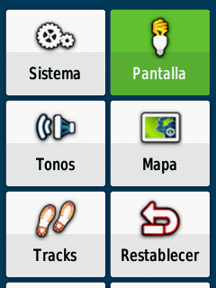
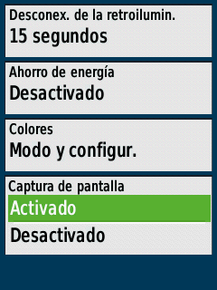
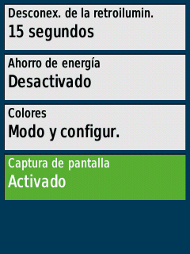
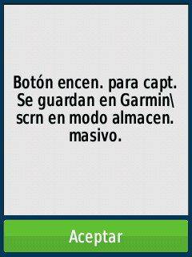

# Hacer capturas de pantalla


Lo primero sera acceder al menú del Garmin, entramos en:&#x20;

`Configuración > Pantalla > Captura de pantalla > Activado`.

<div><figure><figcaption></figcaption></figure> <figure><figcaption></figcaption></figure> <figure><figcaption></figcaption></figure> <figure><figcaption></figcaption></figure> <figure><figcaption></figcaption></figure></div>


El modo se desactiva cuando apagues el GPS


Para hacer una captura de pantalla, nos situamos en la pantalla que queremos capturar, y solo hay que pulsar una vez el botón de encendido/light.

<figure><figcaption></figcaption></figure>


Las capturas de pantalla se guardan en la memoria interna del GPS en formato BMP

```bash
jose@debian:~/media/jose/GARMIN/Garmin/scrn$ ls -l
total 3876
-rw-r--r-- 1 jose jose 230454 ago  7 22:50 1472.bmp
-rw-r--r-- 1 jose jose 230454 ago  7 22:50 1475.bmp
-rw-r--r-- 1 jose jose 230454 ago  7 22:50 324.bmp
-rw-r--r-- 1 jose jose 230454 ago  7 22:50 337.bmp
-rw-r--r-- 1 jose jose 230454 ago  7 22:50 347.bmp
-rw-r--r-- 1 jose jose 230454 ago  7 22:50 364.bmp
-rw-r--r-- 1 jose jose 230454 ago  7 22:50 510.bmp
-rw-r--r-- 1 jose jose 230454 ago  7 22:50 51.bmp
-rw-r--r-- 1 jose jose 230454 ago  7 22:50 532.bmp
-rw-r--r-- 1 jose jose 230454 ago  7 22:50 543.bmp
-rw-r--r-- 1 jose jose 230454 ago  7 22:50 557.bmp
-rw-r--r-- 1 jose jose 230454 ago  7 22:50 55.bmp
-rw-r--r-- 1 jose jose 230454 ago  7 22:50 570.bmp
-rw-r--r-- 1 jose jose 230454 ago  7 22:50 62.bmp
-rw-r--r-- 1 jose jose 230454 ago  7 22:50 71.bmp
-rw-r--r-- 1 jose jose 230454 ago  7 22:50 75.bmp
-rw-r--r-- 1 jose jose 230454 ago  7 22:50 806.bmp
```


Aunque tengas una MicroSD instalada, no se guardan las capturas en la MicroSD

