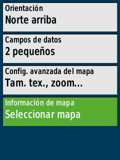
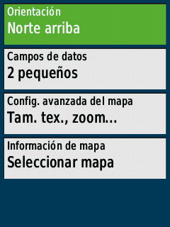

# Mi configuración

<figure><figcaption></figcaption></figure> <figure><figcaption></figcaption></figure> <figure><figcaption></figcaption></figure>

<figure><figcaption></figcaption></figure> <figure><figcaption></figcaption></figure> <figure><figcaption></figcaption></figure>

<figure><figcaption></figcaption></figure> <figure><figcaption></figcaption></figure> <figure><figcaption></figcaption></figure>

Mapas OSM (_España peninsula, Islas Canarias e Islas Baleares_) actualizados cada semana:

<a href="https://github.com/azagramac/OSMforGarmin" class="button primary" data-icon="github-alt">Github</a>

<figure><figcaption></figcaption></figure> <figure><figcaption></figcaption></figure> <figure><figcaption></figcaption></figure>

