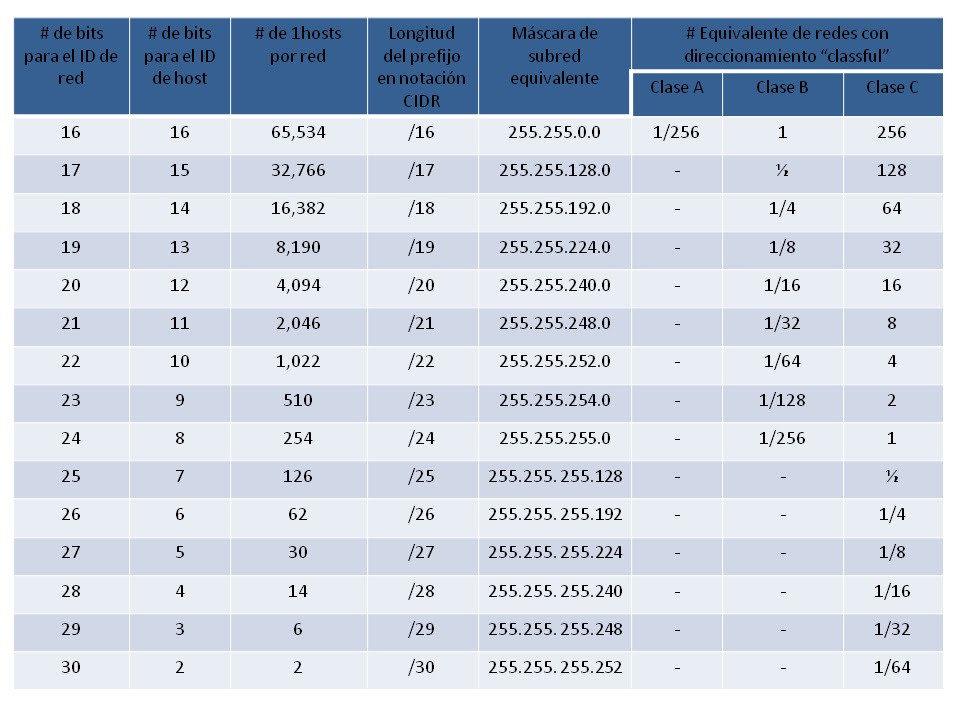

# CIDR, mascaras de subred

El CIDR se basa en el concepto de las [máscaras de subred](https://www.ibm.com/docs/es/aix/7.2?topic=addresses-subnet-masks). Una máscara se superpone a una dirección IP creando así una red secundaria supeditada a Internet. Esta **máscara de subred** señala al router qué porción de la dirección IP se reserva a los hosts (a cada integrante de la red) y qué parte identifica a la red.&#x20;

