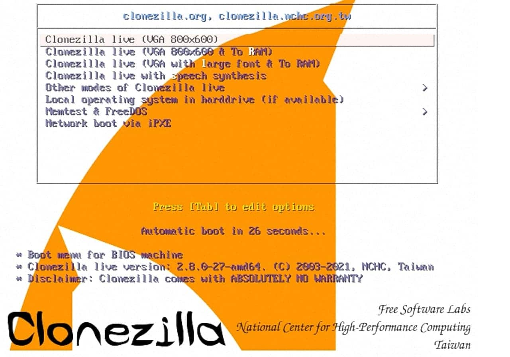

# Clonar disco a NAS con CloneZilla

<figure><figcaption></figcaption></figure>

Lo primero, tenemos que crear un USB o CD, con CloneZilla, nos descargamos la ISO\
[https://clonezilla.org/downloads/download.php?branch=alternative](https://clonezilla.org/downloads/download.php?branch=alternative) ( ⚠️ elegir ISO)

Ya teniendo el USB/CD creado con CloneZilla, arrancamos el equipo con el.

<figure><figcaption></figcaption></figure>

Configuramos el idioma y el idioma del teclado

.jpg>).jpg>)

Comenzamos

<figure><figcaption></figcaption></figure>

Elegiremos la primera opción "**device-image**", ya que vamos a clonar nuestro disco a una imagen

<figure><figcaption></figcaption></figure>

Aquí, como vamos a clonar el disco a nuestro NAS, elegiremos el tipo de conexion, en mi caso "**samba\_server**", si prefieres hacerlo a un disco externo por USB, elije la primera opción.&#x20;

<figure><figcaption></figcaption></figure>

Configuramos el metodo de conexion de red de la maquina donde tenemos el disco que queremos clonar.

<figure><figcaption></figcaption></figure>

Y aquí, configuramos la IP de nuestro NAS, la ruta donde vamos a guardar la imagen y el protocolo samba que vamos a usar. (si no lo conoces, déjalo en auto)

.png>).png>).png>)

La parte de seguridad por defecto en auto. Después nos pedirá nuestra password del NAS para montar el volumen.&#x20;

.png>) .png>)

La siguiente opción, déjalo por defecto.&#x20;

<figure><figcaption></figcaption></figure>


En caso de tener que restaurar, es este punto donde cambia para poder restaurar nuestra imagen a disco.


Aquí le indicamos que queremos clonar, si queremos hacer una copia del disco, completamente elegiremos la primera opción "**savedisk**", si por el contrario queremos guardar las particiones, elegiremos la segunda opción "**saveparts**", en caso de tener que restaurar un disco, realizaremos los pasos anteriores hasta el momento, y aquí seleccionaríamos "**restoredisk**" o "**restoreparts**" según hayamos elegido en el momento de clonar. \
\
En este caso, "**savedisk**" ya que queremos hacer una clonación completa del disco

<figure><figcaption></figcaption></figure>

Aquí le indicamos el nombre de la imagen que vamos a crear a partir de nuestro disco.\
( en caso de tener que restaurar, nos mostraria una lista de las imagenes que tengamos y seleccionariamos la que queramos)

<figure><figcaption></figcaption></figure>

En este punto, nos lista los discos disponibles que tenemos en nuestro equipo, seleccionamos el que vamos a clonar a una imagen.&#x20;

<figure><figcaption></figcaption></figure>

El metodo de compresión de la imagen, lo dejaremos en `-z1p`.&#x20;

<figure><figcaption></figcaption></figure>

Aquí, si hemos realizado un `fsck` antes de la clonación no hace falta, en caso contrario, selecciona la 2ª opcion "`fsck -y`"

<figure><figcaption></figcaption></figure>

En esta parte, seleccionamos que SI, queremos una imagen que podamos restaurar en caso necesario, si no de que queremos la imagen? Esto comprueba que la imagen creada es valida para restaurarla, si al crearla diera error, nos tocaría volver a crearla de nuevo.&#x20;

<figure><figcaption></figcaption></figure>

Cifrado de la imagen. Esto es al gusto de cada uno, personalmente siempre prefiero cifrarlas.


Si disco esta cifrado con LUKS, no cifres la imagen, ya que da problemas a la hora de restaurar el disco.


<figure><figcaption></figcaption></figure>

Esta parte es que quieres que haga el sistema cuando acabe de crear la imagen, lo dejamos por defecto.&#x20;

<figure><figcaption></figcaption></figure>

Y listo! Hace una comprobacion y nos saca un informe como este y nos pregunta que si queremos proceder, le decimos que si "Y"

<figure><figcaption></figcaption></figure>

y comienza a clonar... Aqui dependiendo de la velocidad de lectura de tu disco a clonar, tu red, tu velocidad del NAS, tardara mas o menos, en mi caso unos 7 minutos aprox en clonar un SSD de 1Tb al NAS por red gigabit, ten en cuenta que no clona los espacios vacíos, solo clona la parte de datos y ademas la comprime, en mi caso la suma total de todas las particiones rondaba los 90GB y comprimidos apenas eran 6Gb el tamaño final de la imagen.&#x20;

<figure><figcaption></figcaption></figure>

Cuando termine, verificara que las imagenes son restaurables, si no ha dado ningun error, nos mostrara una ventana asi.&#x20;

<figure><figcaption></figcaption></figure>

Y listo!&#x20;

<figure><figcaption></figcaption></figure>

Detalle de la imagen clonada de Debian 12, cifrado con LUKS.

<figure><figcaption></figcaption></figure>
