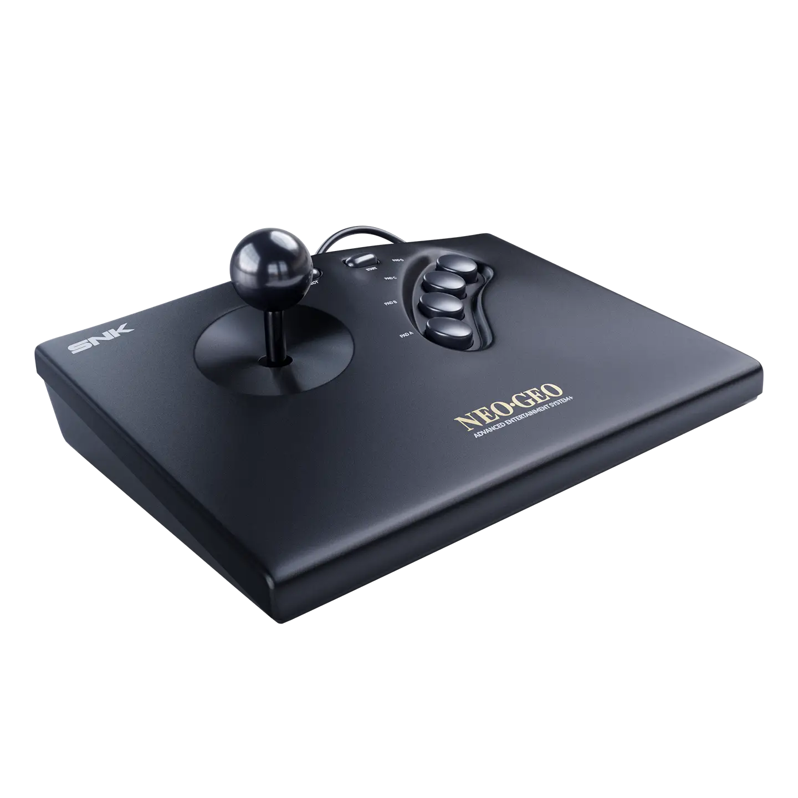
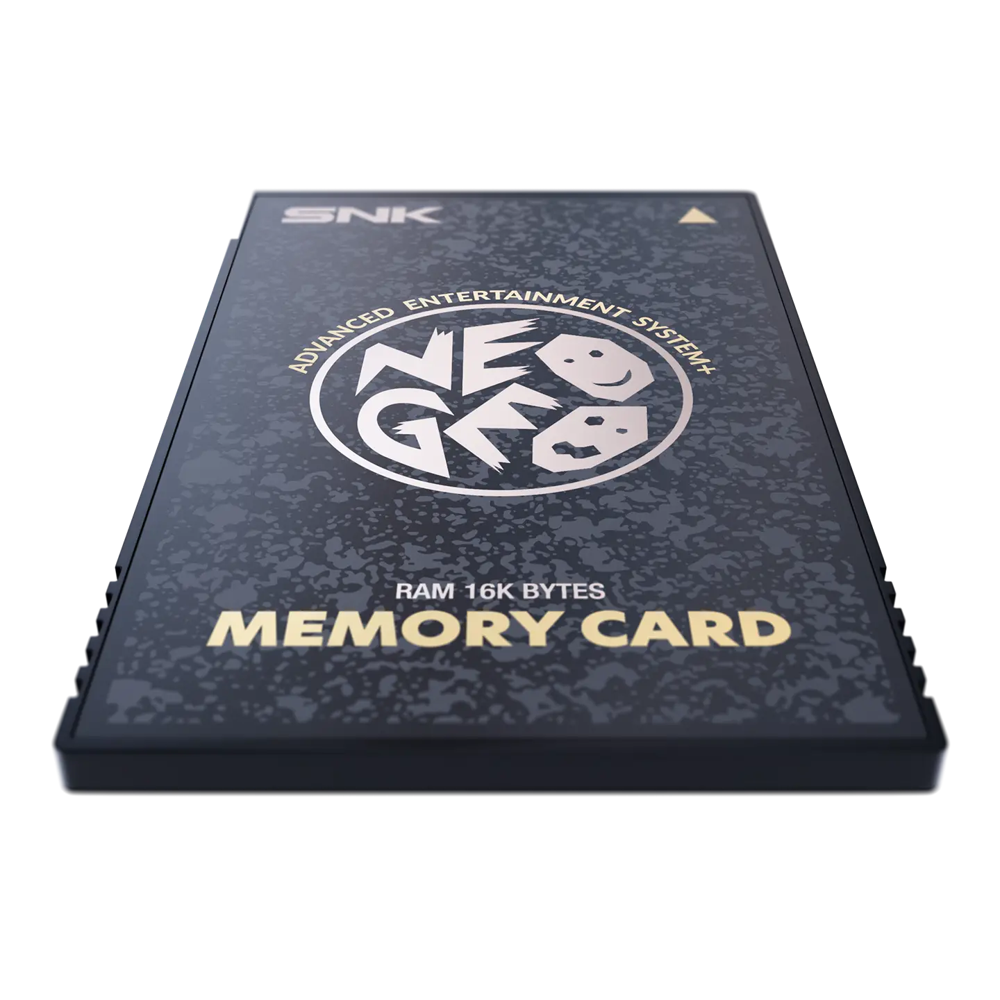
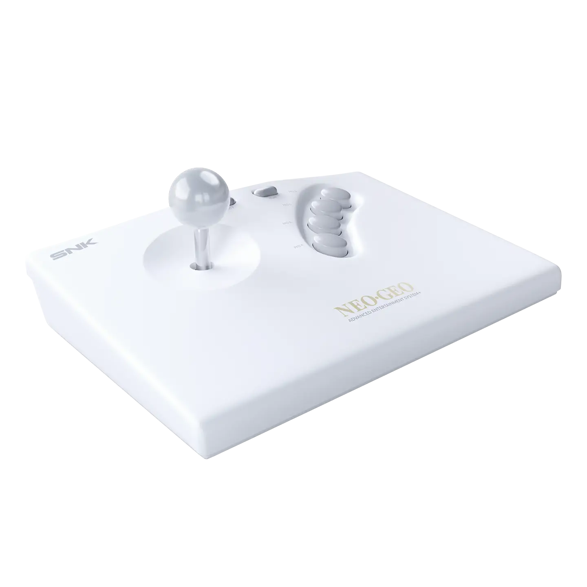
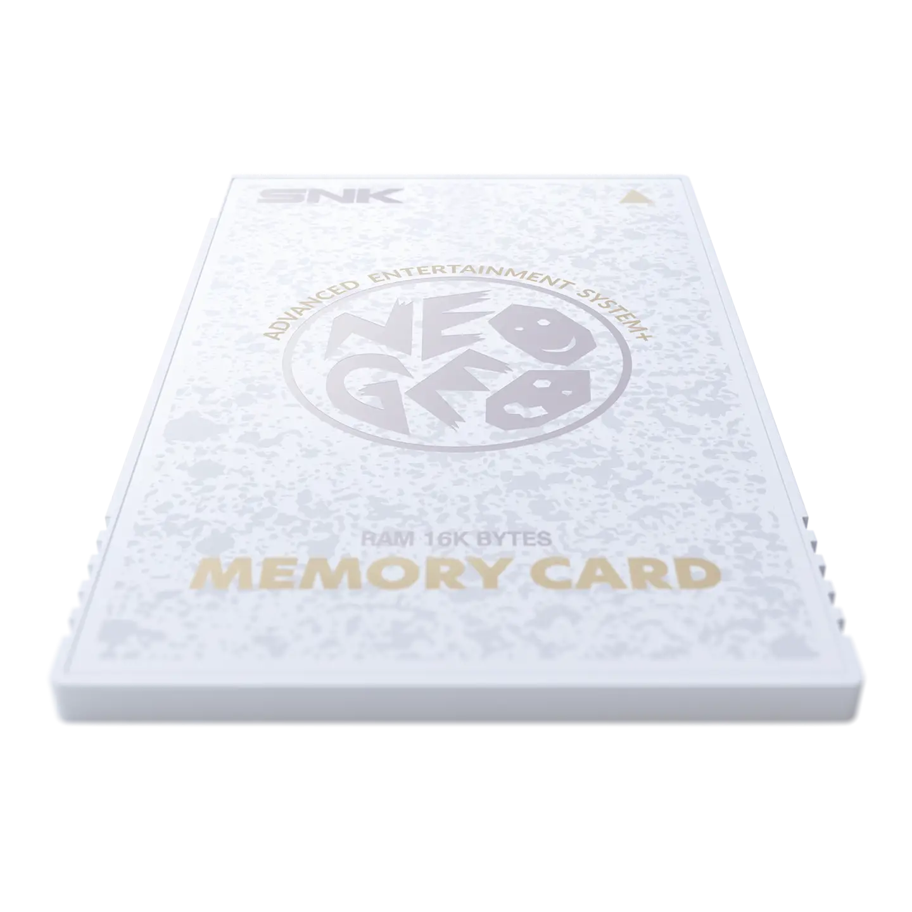
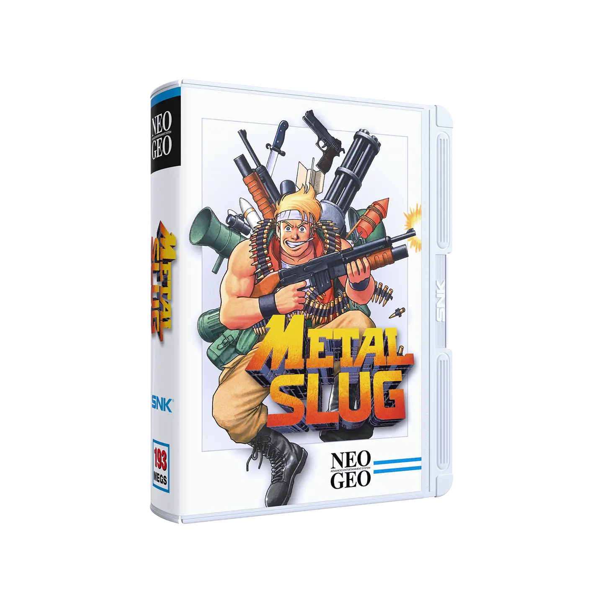

# NeoGeo AES+

### 🎮 KEY FEATURES — NEOGEO AES+

#### 📦 Contenidos

* 🕹️ **Legendaria consola de videojuegos renacida**
* 📺 **Réplica 1:1 de la consola original de los años 90**
* 🎨 **Construcción arcade auténtica sin concesiones**
* 🧠 **Reimplementación fiel del hardware original**
* 🚫 **Sin emulación — basada en chips ASIC rediseñados**

***

#### 🎯 Compatibilidad

* 🎮 Compatible con nuevos cartuchos NEOGEO AES
* 🔁 Retrocompatible con cartuchos originales NEOGEO AES

***

#### ⚙️ Funciones de calidad de vida

* ⚡ Salida HDMI de baja latencia
* 📼 Salida AV original para entusiastas de CRT
* 🔧 Interruptores DIP para:
  * 🌐 Selección de idioma
  * 🚀 Overclocking
  * 🖥️ Selección de modo de pantalla
* 💾 Guardado permanente de récords (High Score Save) mediante Memory Card incluida

***

#### 🎮 Incluye

* 🖥️ Consola **NEOGEO AES+**
* 🎮 Arcade Stick inalámbrico
* 📺 Cable HDMI
* 🔌 Fuente de alimentación

En la edicion blanca incluye ademas de lo anterior.&#x20;

* 🧩 Cartucho del juego **Metal Slug (Blanco), edición exclusiva**
* 🎮 Arcade Stick inalámbrico (Blanco) — réplica 1:1 del original
* 💾 Memory Card (Blanca)
* 📡 Dongle inalámbrico Arcade Stick (15 pines, blanco)
* 🔌 Cable Arcade Stick (15 pines)
* ⚡ Cable de carga USB-C para Arcade Stick

***



#### Edición negra

<figure><figcaption></figcaption></figure>

<figure><figcaption>
NeoGeo AES+
</figcaption></figure> <figure><figcaption>
Stick
</figcaption></figure> <figure><figcaption>
Memory Card
</figcaption></figure>

#### Edición blanca

<figure><figcaption></figcaption></figure>

<figure><figcaption>
NeoGeo AES+ White
</figcaption></figure> <figure><figcaption>
Stick White
</figcaption></figure> <figure><figcaption>
Memory Card White
</figcaption></figure> <figure><figcaption>
Metal Slug White
</figcaption></figure>

#### Links de compra:

* **NeoGeo AES+ (negra)**\
  Amazon: [https://amzn.to/4cIdVGB](https://amzn.to/4cIdVGB) 
* **Stick:**\
  Amazon: [https://amzn.to/4tKpuTV](https://amzn.to/4tKpuTV) 
* **Memory Card:**\
  Amazon: [https://amzn.to/4cXB8mW](https://amzn.to/4cXB8mW) 
* **Juegos:**\
  Metal Slug: [https://amzn.to/4tKpFP5](https://amzn.to/4tKpFP5)\
  The King of Fighters 2002: [https://amzn.to/4uf08wZ](https://amzn.to/4uf08wZ)\
  Garou: Mark of the Wolves: [https://amzn.to/42EuugJ](https://amzn.to/42EuugJ)\
  Samurai Shodown V Special: [https://amzn.to/4tDkwbi](https://amzn.to/4tDkwbi)\
  Big Tournament Golf: [https://amzn.to/4eTcl6a](https://amzn.to/4eTcl6a)\
  Shock Troopers: [https://amzn.to/4eSOLGE](https://amzn.to/4eSOLGE)\
  Pulstar: [https://amzn.to/4ekJxU0](https://amzn.to/4ekJxU0)\
  Magician Lord: [https://amzn.to/4t6QbRs](https://amzn.to/4t6QbRs)\
  Over Top: [https://amzn.to/42FgoM4](https://amzn.to/42FgoM4)\
  Twinkle Star Sprites: [https://amzn.to/3PcWN2H](https://amzn.to/3PcWN2H)
