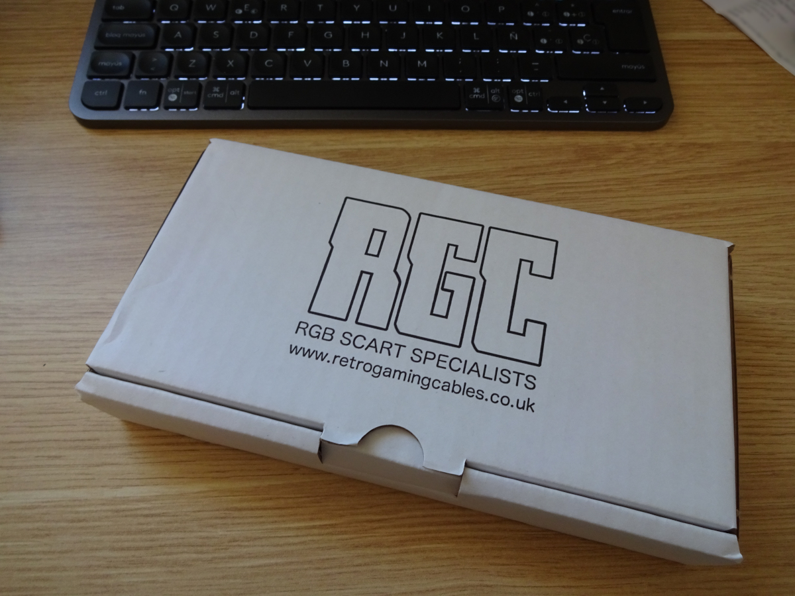
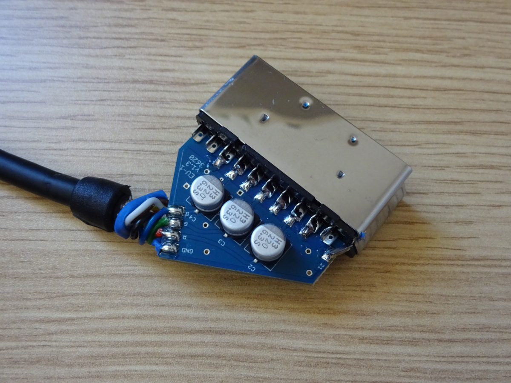
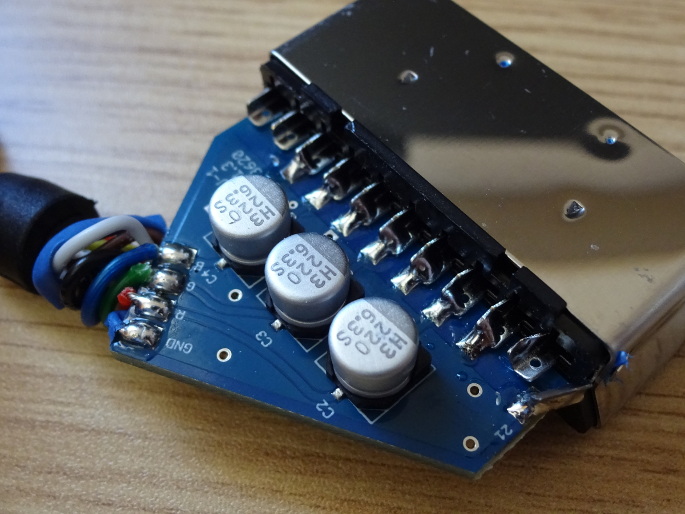
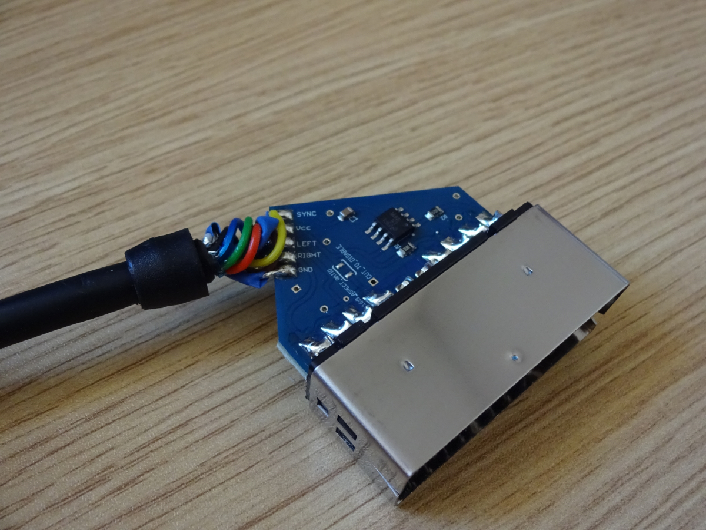
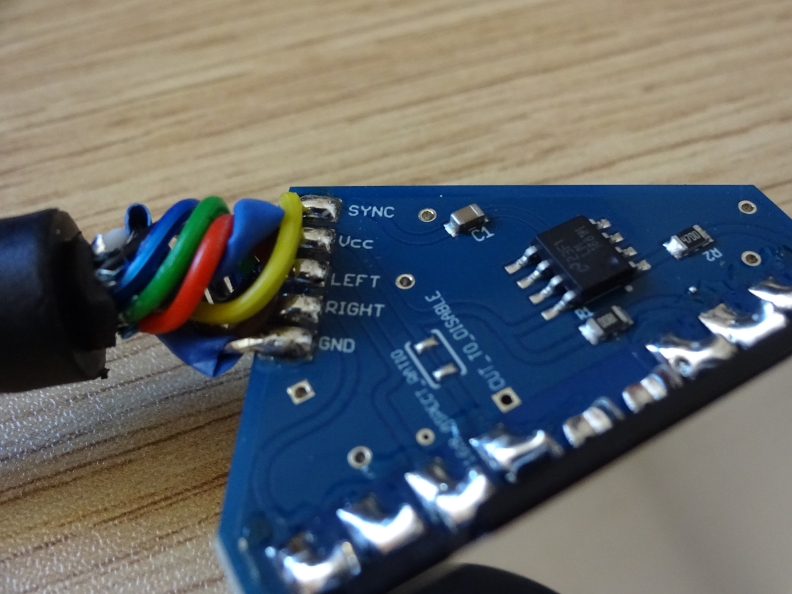

# Review Cable SCART RGB C-SYNC

Cable RGB C-SYNC de RGC UK con chip LM1881

<figure><figcaption></figcaption></figure>

<figure><figcaption></figcaption></figure>

<figure><figcaption></figcaption></figure>

<figure><figcaption></figcaption></figure>

<figure><figcaption></figcaption></figure>

[Cable RGB CSYNC para Playstation 1 ](https://www.retrogamingcables.co.uk/sony-av-accessories/PlayStation-1-RGB-SCART-CABLES/SONY-PLAYSTATION-CSYNC-COMPOSITE-SYNC-RGB-SCART-WTH-LIGHT-GUN-PORT)(valido para Playstation 2)

El chip LM1881 toma una "sincronización sobre sincronización de video compuesto" (HSYNC+VSYNC+CVBS) y elimina el aspecto de video compuesto (CVBS) de la señal, y emite CSYNC (HSYNC+VSYNC), que es la señal de sincronización más limpia disponible cuando se usa un cable SCART RGB. Esto puede ayudar a eliminar artefactos en pantalla no deseados y también puede ser necesaria una señal CSYNC para algunos monitores que solo aceptan CSYNC.

La salida de este LM1881 tiene una resistencia de 470 Ω para que la señal CSYNC sea adecuada para un funcionamiento de 75 ohmios.\
\
 (1) (1) (1).png>)  (1) (1) (1) (1).png>)

[Datasheet LM1881](https://www.ti.com/lit/ds/symlink/lm1881.pdf)
