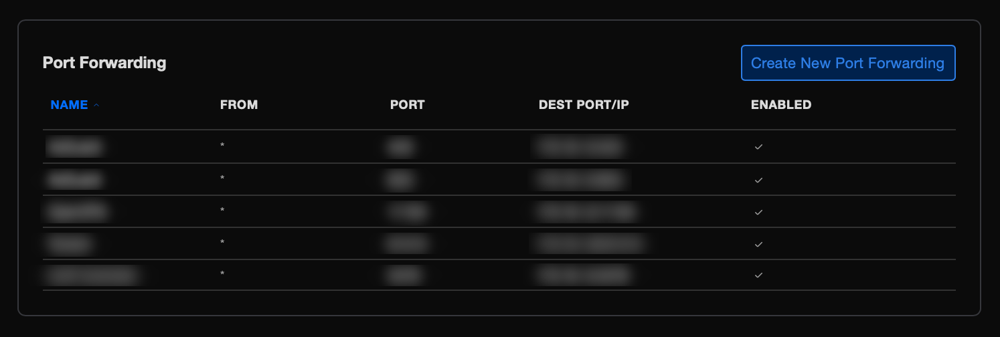
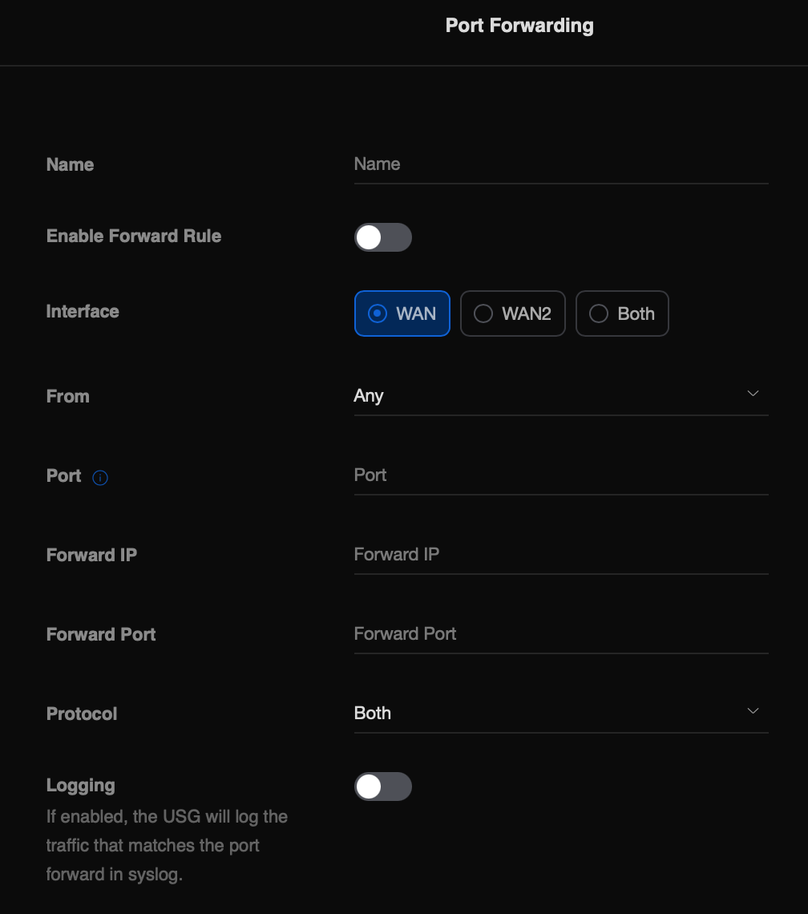

# Abrir puertos en USG Security Gateway

Entorno:\
\- Unifi Controller v6.5.55\
\- USG Security Gateway, firmware v4.4.56

Entramos en nuestro UniFi Controller, y nos vamos a "Settings", en el menu lateral, una vez dentro, nos dirigimos al menu "Advanced Features", y en la parte derecha de la pantalla, "Advanced Gateway Settings"

Una vez dentro, veremos varias opciones, click en "Create New Port Forwarding"

Ahora debemos rellenar el forulario, necesitaremos el puerto externo (el que estara visible desde internet), el interno que sera la maquina donde escuche, y la IP de la maquina y protocolo, TCP y/o UDP.

En "Name", ponemos el servicio que vamos a configurar, habilitamos la opcion "Enable Forward Rule" para que este disponible el puerto, si lo queremos deshabilitar, con desmarcar esa opcion, es suficiente, elegiremos el interface (por defecto WAN), puerto, IP, protocolo y si tenemos configurado una servicio de registro de log, podemos marcar la opcion para añadir el resultado de lo que pase por el servicio de log, ejemplo, rsyslog, kibana...

Guardamos, y dejamos que aprovisione los cambios y ya tendremos listo el acceso.
