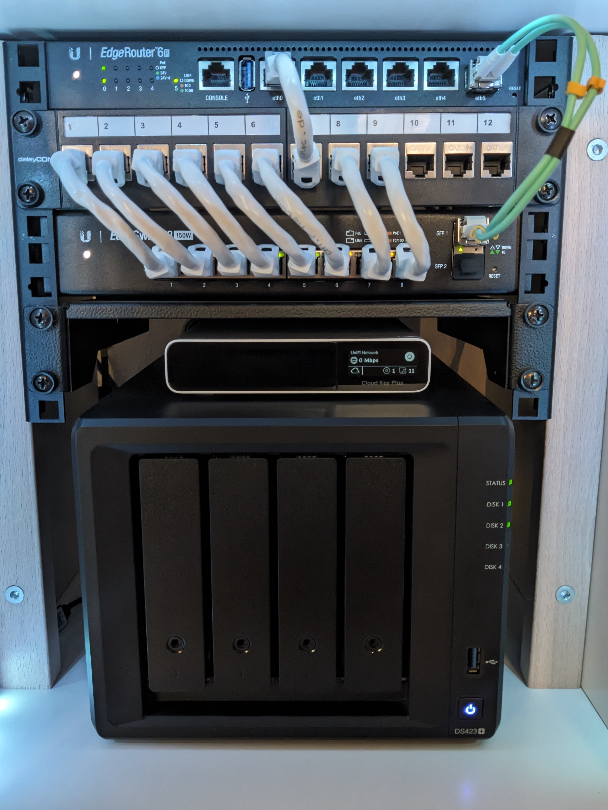

# Configuración vía terminal, red Home

<figure><figcaption></figcaption></figure>

<figure><figcaption></figcaption></figure>

Hardware:

* EdgeRouter 6P, firmware v2.0.9-hotfix.7
* EdgeSwitch 8-150, firmware 1.11.1-lite

.png>) 


Parámetros vía consola en **EdgeRouter**:


```bash
set firewall all-ping enable
set firewall broadcast-ping disable
set firewall group network-group RED_GUEST description 'Network Guest'
set firewall group network-group RED_GUEST network 10.50.1.0/27
set firewall group network-group RED_HOME description 'Network Home'
set firewall group network-group RED_HOME network 10.10.1.0/24
set firewall group network-group RED_IOT description 'Network IoT'
set firewall group network-group RED_IOT network 10.40.1.0/25
set firewall group network-group RED_NAS description 'Network NAS'
set firewall group network-group RED_NAS network 10.20.1.0/28
set firewall group network-group RFC1918-Ranges description 'RFC 1918 Ranges'
set firewall group network-group RFC1918-Ranges network 192.168.0.0/16
set firewall group network-group RFC1918-Ranges network 172.16.0.0/12
set firewall group network-group RFC1918-Ranges network 10.0.0.0/8
set firewall ipv6-name WANv6_IN default-action drop
set firewall ipv6-name WANv6_IN description 'WAN inbound traffic forwarded to LAN'
set firewall ipv6-name WANv6_IN enable-default-log
set firewall ipv6-name WANv6_IN rule 10 action accept
set firewall ipv6-name WANv6_IN rule 10 description 'Allow established/related sessions'
set firewall ipv6-name WANv6_IN rule 10 state established enable
set firewall ipv6-name WANv6_IN rule 10 state related enable
set firewall ipv6-name WANv6_IN rule 20 action drop
set firewall ipv6-name WANv6_IN rule 20 description 'Drop invalid state'
set firewall ipv6-name WANv6_IN rule 20 state invalid enable
set firewall ipv6-name WANv6_LOCAL default-action drop
set firewall ipv6-name WANv6_LOCAL description 'WAN inbound traffic to the router'
set firewall ipv6-name WANv6_LOCAL enable-default-log
set firewall ipv6-name WANv6_LOCAL rule 10 action accept
set firewall ipv6-name WANv6_LOCAL rule 10 description 'Allow established/related sessions'
set firewall ipv6-name WANv6_LOCAL rule 10 state established enable
set firewall ipv6-name WANv6_LOCAL rule 10 state related enable
set firewall ipv6-name WANv6_LOCAL rule 20 action drop
set firewall ipv6-name WANv6_LOCAL rule 20 description 'Drop invalid state'
set firewall ipv6-name WANv6_LOCAL rule 20 state invalid enable
set firewall ipv6-name WANv6_LOCAL rule 30 action accept
set firewall ipv6-name WANv6_LOCAL rule 30 description 'Allow IPv6 icmp'
set firewall ipv6-name WANv6_LOCAL rule 30 protocol ipv6-icmp
set firewall ipv6-name WANv6_LOCAL rule 40 action accept
set firewall ipv6-name WANv6_LOCAL rule 40 description 'allow dhcpv6'
set firewall ipv6-name WANv6_LOCAL rule 40 destination port 546
set firewall ipv6-name WANv6_LOCAL rule 40 protocol udp
set firewall ipv6-name WANv6_LOCAL rule 40 source port 547
set firewall ipv6-receive-redirects disable
set firewall ipv6-src-route disable
set firewall ip-src-route disable
set firewall log-martians enable
# lista de reglas de firewall ocultas por seguridad.
set firewall name WAN_IN default-action drop
set firewall name WAN_IN description 'WAN to internal'
set firewall name WAN_IN rule 10 action accept
set firewall name WAN_IN rule 10 description 'Allow established/related'
set firewall name WAN_IN rule 10 state established enable
set firewall name WAN_IN rule 10 state related enable
set firewall name WAN_IN rule 20 action drop
set firewall name WAN_IN rule 20 description 'Drop invalid state'
set firewall name WAN_IN rule 20 state invalid enable
set firewall name WAN_LOCAL default-action drop
set firewall name WAN_LOCAL description 'WAN to router'
set firewall name WAN_LOCAL rule 10 action accept
set firewall name WAN_LOCAL rule 10 description 'Allow established/related'
set firewall name WAN_LOCAL rule 10 state established enable
set firewall name WAN_LOCAL rule 10 state related enable
set firewall name WAN_LOCAL rule 20 action drop
set firewall name WAN_LOCAL rule 20 description 'Drop invalid state'
set firewall name WAN_LOCAL rule 20 state invalid enable
set firewall options mss-clamp mss 1412
set firewall receive-redirects disable
set firewall send-redirects enable
set firewall source-validation disable
set firewall syn-cookies enable
set interfaces ethernet eth0 duplex auto
set interfaces ethernet eth0 poe output 24v # habilita el POE para conectar Ufiber Nano G
set interfaces ethernet eth0 speed auto
set interfaces ethernet eth0 vif 6 description 'Internet Movistar / O2'
set interfaces ethernet eth0 vif 6 pppoe 0 default-route auto
set interfaces ethernet eth0 vif 6 pppoe 0 dhcpv6-pd pd 0 interface eth1 host-address '::1'
set interfaces ethernet eth0 vif 6 pppoe 0 dhcpv6-pd pd 0 interface eth1 prefix-id ':1'
set interfaces ethernet eth0 vif 6 pppoe 0 dhcpv6-pd pd 0 interface eth1 service slaac
set interfaces ethernet eth0 vif 6 pppoe 0 dhcpv6-pd pd 0 interface eth2 host-address '::1'
set interfaces ethernet eth0 vif 6 pppoe 0 dhcpv6-pd pd 0 interface eth2 prefix-id ':2'
set interfaces ethernet eth0 vif 6 pppoe 0 dhcpv6-pd pd 0 interface eth2 service slaac
set interfaces ethernet eth0 vif 6 pppoe 0 dhcpv6-pd pd 0 prefix-length /56
set interfaces ethernet eth0 vif 6 pppoe 0 dhcpv6-pd rapid-commit enable
set interfaces ethernet eth0 vif 6 pppoe 0 firewall in ipv6-name WANv6_IN
set interfaces ethernet eth0 vif 6 pppoe 0 firewall in name WAN_IN
set interfaces ethernet eth0 vif 6 pppoe 0 firewall local ipv6-name WANv6_LOCAL
set interfaces ethernet eth0 vif 6 pppoe 0 firewall local name WAN_LOCAL
set interfaces ethernet eth0 vif 6 pppoe 0 mtu 1492
set interfaces ethernet eth0 vif 6 pppoe 0 name-server auto
set interfaces ethernet eth0 vif 6 pppoe 0 password adslppp
set interfaces ethernet eth0 vif 6 pppoe 0 user-id adslppp@telefonicapa
set interfaces ethernet eth1 address 192.168.1.1/24
set interfaces ethernet eth1 description eth1
set interfaces ethernet eth1 duplex auto
set interfaces ethernet eth1 poe output off
set interfaces ethernet eth1 speed auto
set interfaces ethernet eth2 address 172.16.1.1/24
set interfaces ethernet eth2 description eth2
set interfaces ethernet eth2 duplex auto
set interfaces ethernet eth2 poe output off
set interfaces ethernet eth2 speed auto
set interfaces ethernet eth3 description eth3
set interfaces ethernet eth3 duplex auto
set interfaces ethernet eth3 poe output off
set interfaces ethernet eth3 speed auto
set interfaces ethernet eth4 description eth4
set interfaces ethernet eth4 duplex auto
set interfaces ethernet eth4 poe output off
set interfaces ethernet eth4 speed auto
set interfaces ethernet eth5 description SFP
set interfaces ethernet eth5 duplex auto
set interfaces ethernet eth5 speed auto
set interfaces ethernet eth5 vif 10 address 10.10.1.1/24
set interfaces ethernet eth5 vif 10 description 'Network Home'
set interfaces ethernet eth5 vif 10 firewall in name HOME_IN
set interfaces ethernet eth5 vif 20 address 10.20.1.1/28
set interfaces ethernet eth5 vif 20 description 'Network NAS'
set interfaces ethernet eth5 vif 20 firewall in name NAS_IN
set interfaces ethernet eth5 vif 40 address 10.40.1.1/25
set interfaces ethernet eth5 vif 40 description 'Network IoT'
set interfaces ethernet eth5 vif 40 firewall in name IOT_IN
set interfaces ethernet eth5 vif 40 mtu 1500
set interfaces ethernet eth5 vif 50 address 10.50.1.1/27
set interfaces ethernet eth5 vif 50 description 'Network Guest'
set interfaces ethernet eth5 vif 50 firewall in name GUEST_IN
set interfaces ethernet eth5 vif 50 mtu 1500
set interfaces loopback lo
set port-forward auto-firewall enable
set port-forward hairpin-nat enable
set port-forward lan-interface eth5
set port-forward wan-interface pppoe0
set protocols static interface-route 172.16.1.0/24 next-hop-interface eth2
set service dhcp-server disabled false
set service dhcp-server hostfile-update disable
set service dhcp-server shared-network-name GUEST authoritative disable
set service dhcp-server shared-network-name GUEST subnet 10.50.1.0/27 default-router 10.50.1.1
set service dhcp-server shared-network-name GUEST subnet 10.50.1.0/27 dns-server 1.1.1.1
set service dhcp-server shared-network-name GUEST subnet 10.50.1.0/27 dns-server 1.0.0.1
set service dhcp-server shared-network-name GUEST subnet 10.50.1.0/27 lease 86400
set service dhcp-server shared-network-name GUEST subnet 10.50.1.0/27 start 10.50.1.2 stop 10.50.1.30
set service dhcp-server shared-network-name HOME authoritative disable
set service dhcp-server shared-network-name HOME subnet 10.10.1.0/24 default-router 10.10.1.1
set service dhcp-server shared-network-name HOME subnet 10.10.1.0/24 dns-server 1.1.1.1
set service dhcp-server shared-network-name HOME subnet 10.10.1.0/24 dns-server 1.0.0.1
set service dhcp-server shared-network-name HOME subnet 10.10.1.0/24 lease 604800
set service dhcp-server shared-network-name HOME subnet 10.10.1.0/24 start 10.10.1.100 stop 10.10.1.200
set service dhcp-server shared-network-name IOT authoritative disable
set service dhcp-server shared-network-name IOT subnet 10.40.1.0/25 default-router 10.40.1.1
set service dhcp-server shared-network-name IOT subnet 10.40.1.0/25 dns-server 8.8.8.8
set service dhcp-server shared-network-name IOT subnet 10.40.1.0/25 dns-server 8.8.4.4
set service dhcp-server shared-network-name IOT subnet 10.40.1.0/25 lease 86400
set service dhcp-server shared-network-name IOT subnet 10.40.1.0/25 start 10.40.1.2 stop 10.40.1.126
set service dhcp-server shared-network-name LAN1 authoritative disable
set service dhcp-server shared-network-name LAN1 subnet 192.168.1.0/24 default-router 192.168.1.1
set service dhcp-server shared-network-name LAN1 subnet 192.168.1.0/24 dns-server 1.1.1.1
set service dhcp-server shared-network-name LAN1 subnet 192.168.1.0/24 dns-server 1.0.0.1
set service dhcp-server shared-network-name LAN1 subnet 192.168.1.0/24 lease 86400
set service dhcp-server shared-network-name LAN1 subnet 192.168.1.0/24 start 192.168.1.38 stop 192.168.1.243
set service dhcp-server shared-network-name LAN2 authoritative disable
set service dhcp-server shared-network-name LAN2 subnet 192.168.2.0/24 default-router 192.168.2.1
set service dhcp-server shared-network-name LAN2 subnet 192.168.2.0/24 dns-server 192.168.2.1
set service dhcp-server shared-network-name LAN2 subnet 192.168.2.0/24 lease 86400
set service dhcp-server shared-network-name LAN2 subnet 192.168.2.0/24 start 192.168.2.38 stop 192.168.2.243
set service dhcp-server shared-network-name NAS authoritative disable
set service dhcp-server shared-network-name NAS subnet 10.20.1.0/28 default-router 10.20.1.1
set service dhcp-server shared-network-name NAS subnet 10.20.1.0/28 dns-server 1.1.1.1
set service dhcp-server shared-network-name NAS subnet 10.20.1.0/28 dns-server 1.0.0.1
set service dhcp-server shared-network-name NAS subnet 10.20.1.0/28 lease 86400
set service dhcp-server shared-network-name NAS subnet 10.20.1.0/28 start 10.20.1.2 stop 10.20.1.14
set service dhcp-server static-arp disable
set service dhcp-server use-dnsmasq disable
set service dns dynamic interface pppoe0 service custom-cloudflare host-name {{ subdomian.domain.com }}
set service dns dynamic interface pppoe0 service custom-cloudflare login {{ your-mail }}
set service dns dynamic interface pppoe0 service custom-cloudflare options 'zone={{ domain.com }} use=web ssl=yes ttl=1'
set service dns dynamic interface pppoe0 service custom-cloudflare password {{ global-api-key }}
set service dns dynamic interface pppoe0 service custom-cloudflare protocol cloudflare
set service dns dynamic interface pppoe0 service custom-cloudflare server api.cloudflare.com/client/v4/
set service dns forwarding cache-size 10000
set service dns forwarding listen-on eth1
set service dns forwarding listen-on eth2
set service dns forwarding name-server 1.1.1.1
set service dns forwarding name-server 1.0.0.1
set service gui http-port 80
set service gui https-port 443
set service gui older-ciphers enable
set service lldp interface eth1
set service lldp interface eth2
set service lldp interface eth3
set service lldp interface eth4
set service lldp interface eth5
set service nat rule 5010 description 'masquerade for WAN'
set service nat rule 5010 outbound-interface pppoe0
set service nat rule 5010 type masquerade
set service ssh port {{ port-ssh }}
set service ssh protocol-version v2
set service ubnt-discover
set service unms disable
set system analytics-handler send-analytics-report false
set system crash-handler send-crash-report false
set system host-name {{ hostname }}
set system login user ubnt level admin
set system name-server 1.1.1.1
set system name-server 1.0.0.1
set system ntp server 0.ubnt.pool.ntp.org
set system ntp server 1.ubnt.pool.ntp.org
set system ntp server 2.ubnt.pool.ntp.org
set system ntp server 3.ubnt.pool.ntp.org
set system ntp server time.cloudflare.com
set system ntp server time.google.com
set system offload hwnat disable
set system offload ipsec enable
set system offload ipv4 forwarding enable
set system offload ipv4 pppoe enable
set system offload ipv4 vlan enable
set system offload ipv6 forwarding enable
set system offload ipv6 pppoe enable
set system syslog global facility all level notice
set system syslog global facility protocols level debug
set system time-zone Europe/Madrid
```

Si quieres ejecutar de forma masiva los comandos en el EdgeRouter, crea un script en el router:

```bash
#!/bin/vbash

CMD=/opt/vyatta/sbin/vyatta-cfg-cmd-wrapper

$CMD begin

$CMD set system offload hwnat disable
$CMD set system offload ipsec enable
$CMD set system offload ipv4 forwarding enable
$CMD set system offload ipv4 pppoe enable
$CMD set system offload ipv4 vlan enable
$CMD set system offload ipv6 forwarding enable
$CMD set system offload ipv6 pppoe enable
$CMD set system syslog global facility all level notice
$CMD set system syslog global facility protocols level debug
$CMD set system time-zone Europe/Madrid
... # tantos comandos de configuracion necesites.
$CMD commit
$CMD end
$CMD save

exit
```

Le damos permisos de ejecución, y lo ejecutamos directamente desde el router, y esperamos a que termine, el tiempo dependerá de la lista que tengamos de parámetros de configuración.


* Información de [Hardware offloading](https://help.uisp.com/hc/en-us/articles/22591077433879-EdgeRouter-Hardware-Offloading)
* Habilitar [DDNS Cloudflare](configurar-ddns-cloudflare-en-edgerouter-4.md)


<figure><figcaption></figcaption></figure>

Parámetros vía consola en **EdgeSwitch**:

Ver configuración actual

<pre class="language-bash"><code class="lang-bash">$ ssh user@ip-switch
<strong>user@ip-switch's password: 
</strong>  _____    _
 | ____|__| | __ _  ___
 |  _| / _  |/ _  |/ _ \         (c) Ubiquiti, Inc.
 | |__| (_| | (_| |  __/
 |_____\__._|\__. |\___|         https://www.ui.com
             |___/

Welcome to EdgeSwitch

********************************* NOTICE **********************************
* By logging in to, accessing, or using any Ubiquiti product, you are     *
* signifying that you have read our Terms of Service (ToS) and End User   *
* License Agreement (EULA), understand their terms, and agree to be       *
* fully bound to them. The use of CLI (Command Line Interface) can        *
* potentially harm Ubiquiti devices and result in lost access to them and *
* their data. By proceeding, you acknowledge that the use of CLI to       *
* modify device(s) outside of their normal operational scope, or in any   *
* manner inconsistent with the ToS or EULA, will permanently and          *
* irrevocably void any applicable warranty.                               *
***************************************************************************

(edgeswitch-8) > en
Password: ***********************

(edgeswitch-8) # show running-config
</code></pre>


**Habilitar UISP** (requiere suscripción desde el 1 Julio 2025)



```sh
enable
configure
service unms
service unms key wss://{your_domain}.uisp.com:443+{token}+allowSelfSignedCertificate
exit
write memory confirm
exit
```


**Habilitar LLDP**





```bash
enable
configure
interface 0/1-0/10
lldp transmit
lldp receive
lldp transmit-tlv port-desc
lldp transmit-tlv sys-name
lldp transmit-tlv sys-desc
lldp transmit-tlv sys-cap
lldp transmit-mgmt
lldp notification
lldp med confignotification
exit
write memory
```

<figure><figcaption></figcaption></figure>
