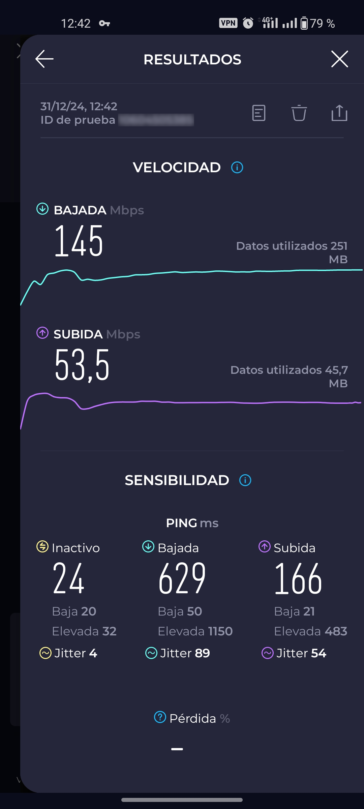

# Configurar WireGuard en EdgeRouter 4 / 6P

<figure><figcaption></figcaption></figure>

Vamos a configurar la VPN de WireGuard en el EdgeRouter 4 (válido para el 6P).


Primero de todo, nos conectamos por terminal al router

<pre class="language-sh"><code class="lang-sh">$ ssh ubnt@ip_router
  _____    _            
 | ____|__| | __ _  ___          (c) 2010-2020
 |  _| / _  |/ _  |/ _ \         Ubiquiti Networks, Inc.
 | |__| (_| | (_| |  __/         
 |_____\__._|\__. |\___|         https://www.ubnt.com
             |___/

Welcome to EdgeOS

By logging in, accessing, or using the Ubiquiti product, you
acknowledge that you have read and understood the Ubiquiti
License Agreement (available in the Web UI at, by default,
http://192.168.1.1) and agree to be bound by its terms.

<strong>ubnt@XXX.XXX.XXX.XXX's password: 
</strong>Linux EdgeRouter-4 4.9.79-UBNT #1 SMP Thu Jun 15 11:34:36 UTC 2023 mips64
Welcome to EdgeOS
ubnt@EdgeRouter-4:~$
</code></pre>


Con el fin de tener todo organizado, creamos una carpeta de nombre `wireguard` en `/home/$user`

```sh
mkdir wireguard && cd wireguard
```


### Descargar e instalar wireguard

Ahora, descargamos el paquete de wireguard para el EdgeRouter 4 (válido para el 6P, también hay otros modelos disponibles)


Antes de nada, todo este tutorial se ha realizado en la versión de firmware **v2.0.9-hotfix.7**.


<figure><figcaption></figcaption></figure>

Repositorio oficial de WireGuard para EdgeOS: [https://github.com/WireGuard/wireguard-vyatta-ubnt/releases](https://github.com/WireGuard/wireguard-vyatta-ubnt/releases)

<pre class="language-sh"><code class="lang-sh"><strong>curl -OL https://github.com/WireGuard/wireguard-vyatta-ubnt/releases/download/1.0.20220627-1/e300-v2-v1.0.20220627-v1.0.20210914.deb
</strong></code></pre>


Ya con el paquete descargado, lo instalamos

```sh
sudo dpkg -i e300-v2-v1.0.20220627-v1.0.20210914.deb
```

y verificamos la instalación

```sh
ubnt@EdgeRouter-4:~$ sudo wg --version
wireguard-tools v1.0.20210914 - https://git.zx2c4.com/wireguard-tools/
```


### Generar claves

<figure><figcaption></figcaption></figure>

Generamos las clave privada y pública y tambien la preshared-key

```sh
wg genkey | tee /config/auth/wireguard.key | wg pubkey >  /config/auth/wireguard.pub
wg genpsk | tee /config/auth/wireguard.psk
```

Comprobamos las claves

```sh
ubnt@EdgeRouter-4:~$ ls -l /config/auth/
total 12
-rw-r--r--    1 ubnt     vyattacf        45 Dec 31 02:13 wireguard.key
-rw-r--r--    1 ubnt     vyattacf        45 Dec 31 02:13 wireguard.psk
-rw-r--r--    1 ubnt     vyattacf        45 Dec 31 02:13 wireguard.pub
```


### Definir reglas

Ahora definiremos las reglas.

```sh
configure
set firewall name WAN_LOCAL rule 20 description 'Allow WireGuard'
set firewall name WAN_LOCAL rule 20 action accept
set firewall name WAN_LOCAL rule 20 protocol udp
set firewall name WAN_LOCAL rule 20 destination port 51820
commit ;save
```

El puerto `51820`, es por defecto, pero mejor utiliza otro.&#x20;

### Configurar Interface

```sh
configure
set interfaces wireguard wg0 description "WireGuard"
set interfaces wireguard wg0 private-key /config/auth/wireguard.key
set interfaces wireguard wg0 address 10.1.1.1/24
set interfaces wireguard wg0 listen-port 51820
set interfaces wireguard wg0 route-allowed-ips false
commit ;save
```

En `address`, introduce la IP que quieras usar como servidor de wireguard, y asegurate de seleccionar el puerto que has definido en las reglas en el paso anterior.&#x20;

Te habrás fijado que la opción `route-allowed-ips` está en false, es porque vamos a establecer acceso a la LAN.&#x20;


### Configurar peers

Ya tenemos la parte de la red configurada, ahora toca generar los clientes.&#x20;

Generamos la clave privada y pública de nuestra peer, (aquí podemos generar tantas como queramos.)

```sh
wg genkey | tee /home/ubnt/wireguard/peer.key | wg pubkey > /home/ubnt/wireguard/peer.pub
```


Necesitaremos la clave privada (`peer.key`) que usaremos luego para configurar nuestra App.&#x20;

Hacemos un cat a nuestra clave pública de nuestra peer

```sh
cat /home/ubnt/wireguard/peer.pub
```

y copiamos nuestra clave.&#x20;


Ahora configuraremos nuestro peer, adaptarlo a vuestra configuración.&#x20;

```sh
configure
set interfaces wireguard wg0 peer {your peer pub key} description "Android"
set interfaces wireguard wg0 peer {your peer pub key} allowed-ips 192.168.1.0/24
set interfaces wireguard wg0 peer {your peer pub key} endpoint {your_sub_domain.domain.com}:51820
set interfaces wireguard wg0 peer {your peer pub key} persistent-keepalive 15
set interfaces wireguard wg0 peer {your peer pub key} preshared-key /config/auth/wireguard.psk
commit ;save
```

En `allowed-ips`, le indicamos el rango de ips permitido a ese peer, podemos poner el comodin `0.0.0.0/0` o un rango específico, cambiar el rango si fuera necesario.&#x20;

Debereis indicar también vuestro endpoint para poder acceder remotamente a vuestra red y el puerto definido en la regla


Realizaremos este paso tantas veces como peers tengamos que generar.&#x20;



Ya quedaría configurar nuestra app.&#x20;

<figure><figcaption></figcaption></figure>
