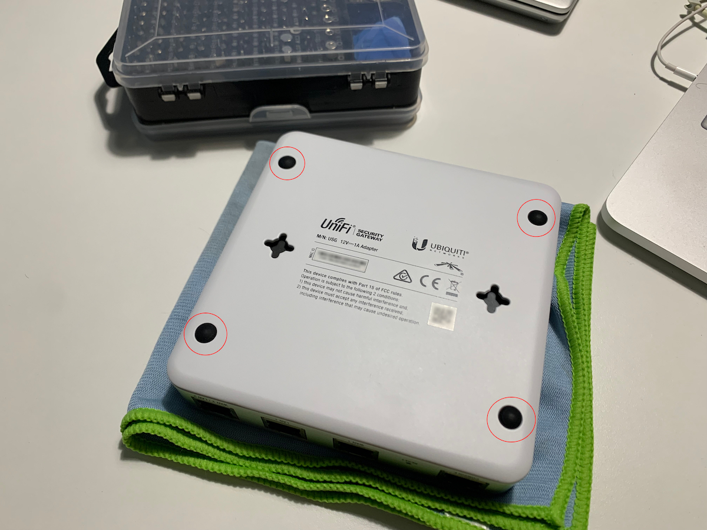
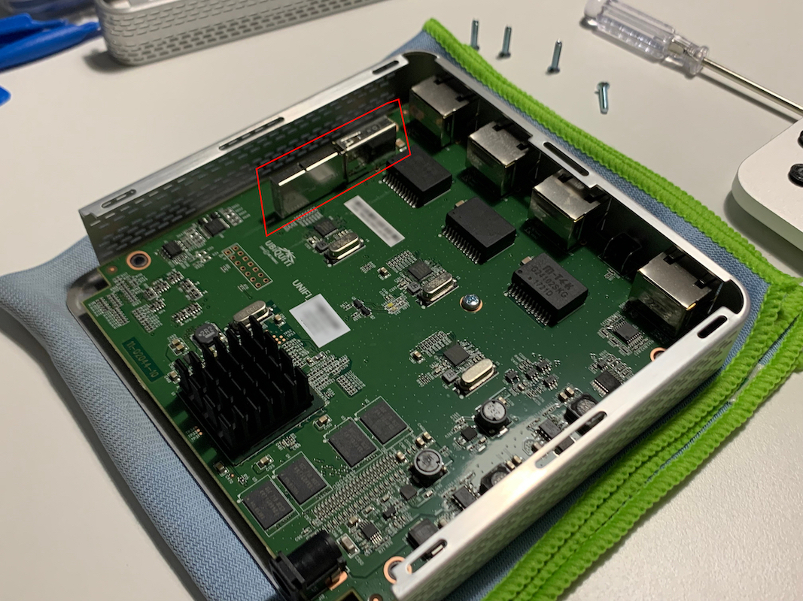
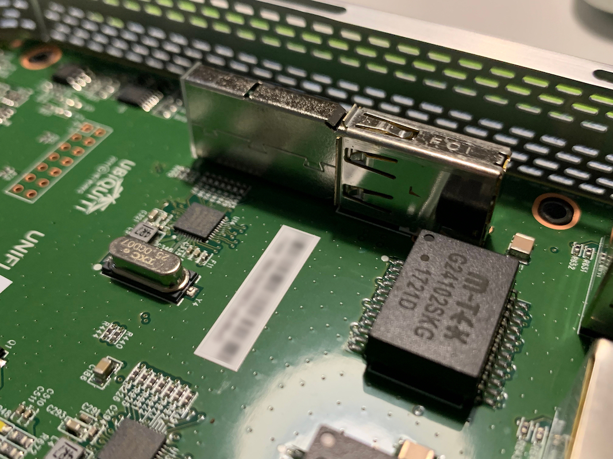
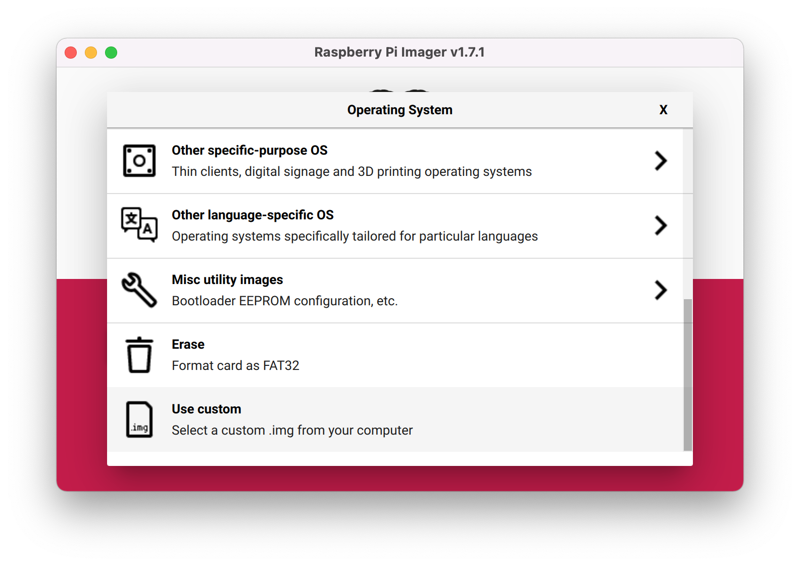
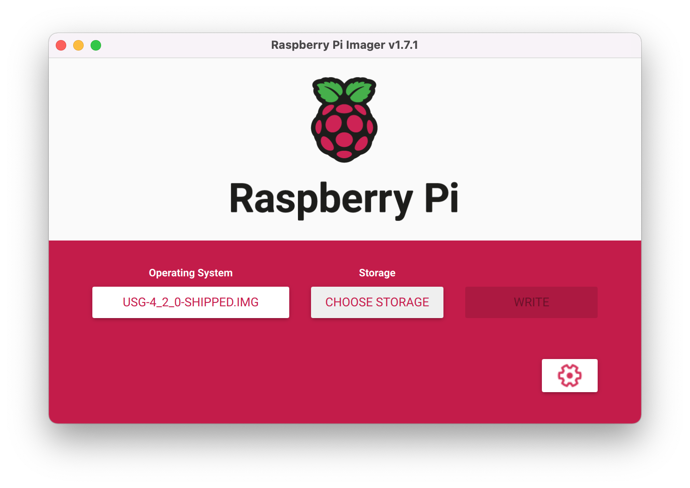

# Restaurar firmware USG Security Gateway

La memoria del USG es un USB interno, abriremos el USG para formatear el USB y cargarle de nuevo el firmware, son 4 tornillos de tipo estrella bajo las almoadillas de la base.



Una vez abierto, veremos la memoria USB.





Es un pendrive de 4Gb de almacenamiento, lo conectamos al ordenador y lo formateamos en fat32, asi eliminamos todas las particiones.

Nos descargamos la imagen base desde Ubiquiti para poder restaurar el firmware, es la v4.2

```
https://dl.ubnt-ut.com/cmb/USG-4_2_0-shipped.img.bz2
```

[Link alternativo](https://mega.nz/file/ccRWTZ5T#1eUI_fasXVwfyFlWv2MvM4wlJgQLAUimOygTcrBjmok)

La descomprimes, y tienes un fichero .img, el MD5 del .img es

```
9c09035c3f2bce4bbc8cb1f71c5f04b2
```

Ahora solo queda cargar la imagen en el USB, se puede hacer con varias aplicaciones, personalmente uso la de RaspberryPi Imager, [https://www.raspberrypi.com/software/](https://www.raspberrypi.com/software/).

Abrimos la App y seleccionamos "Choose OS", nos aparecera esta ventana, y al final elegimos "Use custom", localizamos el fichero .img y elegimos el dispositivo, tardara unos minutos...





Mientras se crea el USB con el .img, nos vamos a nuestro UniFi controller y eliminamos el USG que nos aparece.


Cuando termine de crearse la imagen, volvemos a colocar el USB en el USG, lo cerramos, y conectamos los cables, esperamos a que inicie, luego abirmos nuestro UniFi Controller y nos pedira adoptarlo y actualizar, esperamos a que termine... sera un proceso lento, muy lento...\
\
End!
